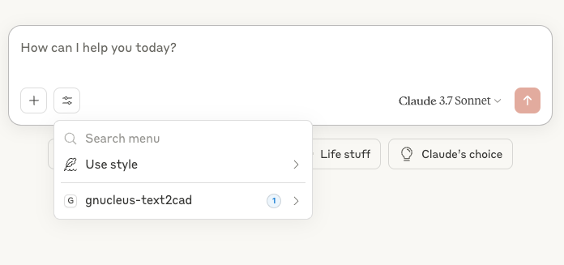
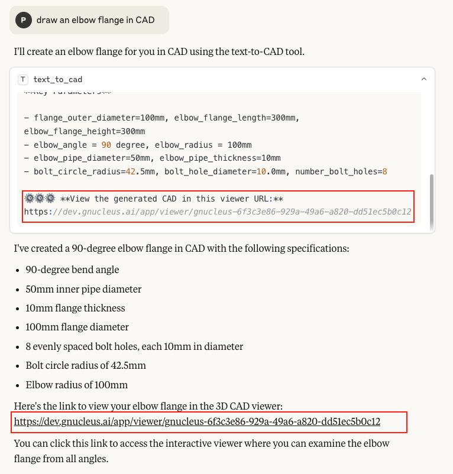
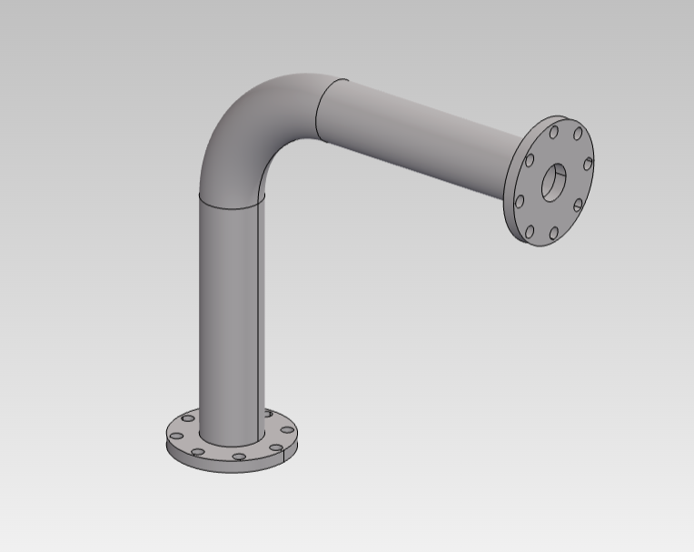

# gNucleus Text To CAD MCP server
A Model Context Protocol (MCP) server that connects to gNucleus API, allowing gNucleus GenAI Models to generate CAD parts/assemblies from text input.

## Prerequisites

- Python 3.7+
- gNucleus Developer Accounts with:
  - gNucleus API key

## Setup
1. Clone this repository
2. Create and activate a virtual environment (recommended):
   ```
   python -m venv .venv
   source .venv/bin/activate  # On Windows: .venv\Scripts\activate
   ```
3. Install dependencies:
   ```
   pip install -r requirements.txt
   ```
4. Create a `.env` file in the root directory with the following variables:
   
   **Invidisual user**
   ```
   GNUCLEUS_HOST="genai.gnucleus.ai"
   GNUCLEUS_API_KEY=<your-personal-api-key>
   ```
   **Enterprise user**
   ```
   GNUCLEUS_HOST="genai.gnucleus.ai"
   GNUCLEUS_API_KEY=<your-team-key>
   GNUCLEUS_ORG_ID=<your-team-id>
   ```   

### Obtaining gNucleus API KEY

1. **gNucleus Account**: sign-up on https://gnucleus.ai/
2. **API KEY**: Create a personal access token in gNucleus:
   - Go to User Settings (click your user icon in the top right)
   - Select "Developer" tab
   - Click "Manage" under "API Key"
   - Generate a new API KEY, and save it immediately
   - Each account start with 300 free API credit
  
  
## Running the Server

Start the MCP server:
```
python main.py
```

You can test the MCP server using the inspector by running 

```
npx @modelcontextprotocol/inspector python3 main.py
```

## Available MCP Tools

The following MCP tools are available:

 - **text_to_cad(input: str)** - Generate CAD from input

## Example Prompt with LLMs
When used with LLMs that support the MCP protocol, this server enables natural language interaction with gNucleus:
### 1. Text to CAD
- "draw a block in CAD"
- "draw a block with length=80mm, width=40mm, height=20mm in CAD"
- "draw a spur gear shaft in CAD"
- "draw a spur gear shaft with number_teeth=20 in CAD"
- "draw an elbow flange in CAD"
- "draw an elbow flange with number_bolt_holes=4 in CAD"

i18n support: You can use any language as the prompt, in general english works better than other languages, but it should work in general.
- Chinese: "在CAD中绘制一个大小为10mm的方块"
- Spanish: "Dibuja un bloque cuadrado de 10 mm en CAD"

### 2. Text to Assembly
- "Generate a tapered roller bearing"

### 3. Result CAD Display
The generated result include the design spec with **Key Parameter**, **Description** and a shared URL with 3D display viewer. The shared URL will be expired in 24 hrs. 

## Claude Desktop Setup
### 1. Add or update the Claude Desktop configuration file(claude_desktop_config.json):
### virtual python environment
If you use virtual python enviroment, use this config:
```json
{
  "mcpServers": {
    "gnucleus": {
      "command": "/ABSOLUTE/PATH/TO/YOUR/text-to-cad-mcp/.venv/bin/python",
      "args": [
        "/ABSOLUTE/PATH/TO/YOUR/text-to-cad-mcp/main.py"
      ],
      "workingDirectory": "/ABSOLUTE/PATH/TO/YOUR/text-to-cad-mcp",
      "env": {
        "GNUCLEUS_HOST": "genai.gnucleus.ai",
        "GNUCLEUS_API_KEY": "YOUR_API_KEY_HERE",
      }
    }
  }
}
```
### global python environment
If you use global python enviroment and also installed the requirments.txt into your global python enviroment, use this config
```json
{
  "mcpServers": {
    "gnucleus": {
      "command": "python",
      "args": [
        "/ABSOLUTE/PATH/TO/YOUR/text-to-cad-mcp/main.py"
      ],
      "workingDirectory": "/ABSOLUTE/PATH/TO/YOUR/text-to-cad-mcp",
      "env": {
        "GNUCLEUS_HOST": "genai.gnucleus.ai",
        "GNUCLEUS_API_KEY": "YOUR_API_KEY_HERE",
      }
    }
  }
}
```

### 2. Save the file and restart Claude Desktop  
You should see the gNucleus Text-To-CAD tools in Claude



### 3. Chat with Claude to generate the CAD model
Chat with Claude and add "in CAD" in each prompt can help Claude to trigger the Text-To-CAD tool better.


The generated result include the design spec with **Key Parameter**, **Description** and a shared link with 3D display viewer. The shared URL will be expired in 24 hrs. 

If Claude didn't output the shared URL in the chat message, you can ask Claude to always output the shared URL.

Click the shared URL, it will display the CAD model in gNucleus 3D viewer, you can 
- Rotate by holding the left mouse button
- Pan by holding the right mouse button 
- Zoom using the middle mouse button 


Note: Downloading CAD models from the viewer is not yet supported. To download the model, please log in to https://gnucleus.ai and try the same prompt using the full feature set.

## Troubleshooting

### CAD Model
If the CAD model looks incorrect or only partially generated, try logging in at https://gnucleus.ai, enter the same prompt, and download the CAD file (e.g., FreeCAD format). Then open it in your CAD software(e.g. FreeCAD ). This issue is often caused by incomplete generation of CAD features within the part.

You can also report a bug or contact us with the model link and prompt at https://gnucleus.ai/contact.

## Security Considerations

- Secure your `.env` file and never commit it to github
- Run this server in a secure environment